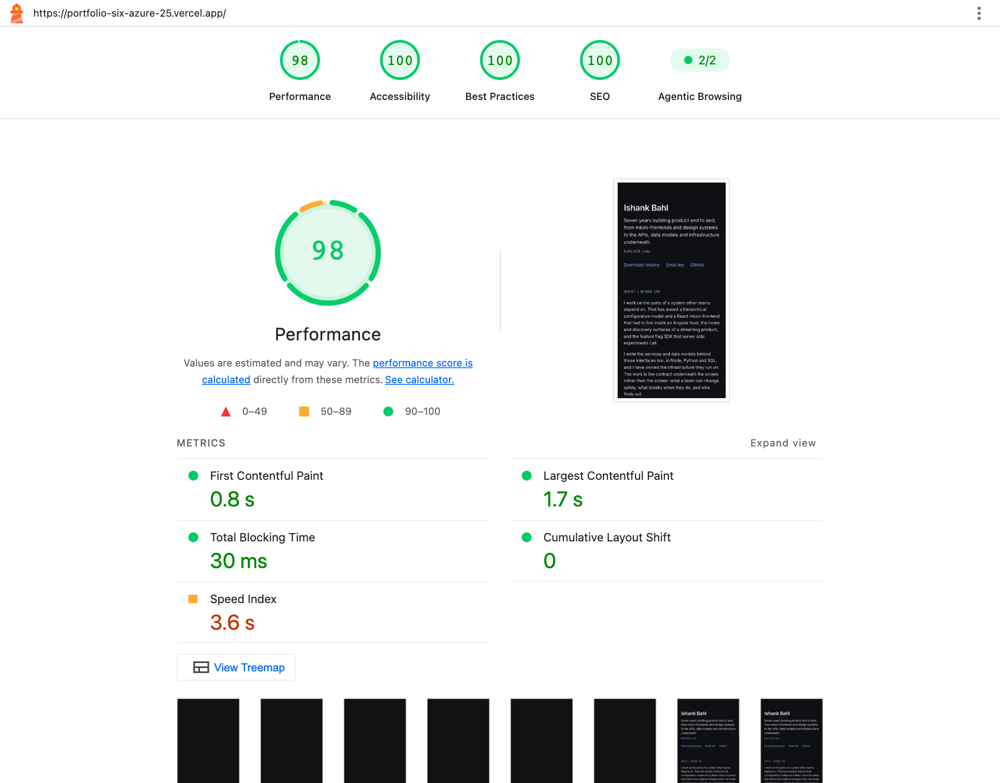

# Portfolio landing page

One prerendered route. No client-side routing, no data fetching, no server at runtime.

Live: https://portfolio-six-azure-25.vercel.app
Resume: https://portfolio-six-azure-25.vercel.app/ishank-bahl-resume.pdf

## Stack

Next.js 15.5.24 (App Router) · TypeScript strict · Tailwind v4 · Playwright · Node 22 · pnpm

`output: 'export'`, so `next build` emits static files to `out/` and Vercel serves them from a CDN.
Nothing runs on a server.

## How it runs

```
content/resume.json          all content, single source of truth
        │
        ▼
lib/resume.ts                typed accessor, annotated so JSON drift fails typecheck
        │
        ├──► app/layout.tsx  metadata, font, analytics
        └──► app/page.tsx    composes the section components
                    │
                    ▼
             next build       prerenders to static HTML at build time
                    │
                    ▼
             out/index.html   what the CDN serves
```

Every component is a server component, so none of this reaches the browser. The only JavaScript a
visitor downloads is the framework and two analytics libraries.

## Repo structure

```
app/
  layout.tsx           html shell, metadata, font loading, skip link, header, analytics
  page.tsx             composes the sections, owns the page bands
  not-found.tsx        styled 404, since the CDN serves it for any mistyped url
  globals.css          design tokens, colour schemes, focus ring
  robots.ts            generates robots.txt at build (needs force-static under export)
  icon.svg             favicon
  fonts/               committed Inter latin subset + OFL licence
components/
  SiteHeader.tsx       sticky header, in-page nav, resume action
  Hero.tsx             two column hero: copy left, photo and facts card right
  Intro.tsx            prose
  Skills.tsx           grouped pills
  SelectedWork.tsx     three cards: problem, what I built, decision and its cost
  Experience.tsx       employment history
  SiteFooter.tsx       contact links
  Section.tsx          section shell, wires aria-labelledby for the landmark
  TextLink.tsx         the two link styles
lib/
  resume.ts            typed content accessor
  person-json-ld.ts    schema.org Person built from the same JSON the page renders
content/resume.json    all content
public/                resume PDF, hero photo, Open Graph image, favicon
tests/                 6 Playwright specs, 7 cases
scripts/
  check-js-budget.mjs  CI gate on application JavaScript
  check-contrast.mjs   asserts WCAG ratios from the hex values in globals.css
  generate-og.mjs      regenerates the Open Graph image
  check-placeholders.mjs  fails if placeholder markers remain
docs/adr/              three decision records
```

## Features

- Content and rendering are separate. Editing the page is a JSON commit, not a code commit.
- Light and dark via `prefers-color-scheme`. No toggle, so no flash-prevention script and no
  persistence layer.
- `Person` JSON-LD, Open Graph and Twitter tags, canonical URL, all derived from the same JSON.
- Open Graph image generated by a script from the same font and colour tokens as the page, so the
  preview cannot drift from the site.
- Resume PDF served as a static asset with a text layer intact, so applicant tracking systems can
  parse it.
- Selected work: three cards naming a problem, what I built, and one decision with what it cost.
- Accessibility: one `h1`, no heading skips, named landmarks, working skip link, visible focus,
  contrast asserted by script in both schemes.

## Constraints

These are enforced, not aspirational.

| Constraint | Enforced by |
|---|---|
| Application JavaScript under 6 kB gzipped | `pnpm budget`, fails CI |
| Server components only, two analytics exceptions | code review, and the budget gate catches drift |
| No `next/image` | it costs 5.39 kB of route JS and emits `/_next/image` URLs no server answers under `export` |
| No content hardcoded in components | everything reads from `content/resume.json` |
| No `any`, strict mode on | `pnpm typecheck` |
| Zero layout shift | `next/font` metric overrides, explicit dimensions, nothing loads after paint |

## Numbers

Measured against the deployed URL.

| | |
|---|---|
| Framework baseline, First Load JS | 102 kB gzipped |
| Application JavaScript | 2.34 kB, all of it the two analytics libraries |
| Route JS emitted for `/` | 127 B |
| Transfer, first visit, cold cache, brotli | ~221 kB over 11 requests |
| Lighthouse mobile | performance 98 to 100, accessibility 100, best practices 100, SEO 100 |
| Cumulative Layout Shift | 0 |
| Largest Contentful Paint | 1.47 s, against a 1.5 s target. 0.60 s without the hero photo |

The hero photo is the LCP element and it costs 0.87 s. Measured both ways on a 4x CPU and Slow 4G
profile: 0.60 s with the image blocked, 1.47 s with it. That is inside the 1.5 s target with very
little room, and the photo is what stops the page reading as a formatted CV. Lighthouse simulates
throttling rather than applying it and runs pessimistic, so its figure for the same page is higher.

Layout shift is 0 either way, because the `img` carries its real intrinsic `width` and `height`.

102 kB of the total is the framework and arrives before any application code. See
[ADR 0003](docs/adr/0003-framework-cost.md).



## Commands

```
pnpm install
pnpm dev
```

The gate, in the order CI runs it:

```
pnpm typecheck
pnpm lint
pnpm build
pnpm budget
pnpm test:e2e
```

`pnpm budget` reads `out/index.html`, sorts every referenced script into framework, legacy polyfill
or application, gzips the application ones and exits non-zero over 6 kB. It measures the HTML rather
than the build manifest because the two disagree: the manifest lists a page chunk the HTML never
references, since the page ships no client code.

`pnpm og` regenerates `public/og.png`. Run it when the name, positioning line or site URL changes.

`pnpm contrast` asserts the WCAG ratios, reading the hex values out of `app/globals.css` so the check
cannot drift from the palette.

`pnpm check:placeholders` fails if any placeholder marker is left in the tree.

## Decisions

- [ADR 0001](docs/adr/0001-serve-static-pdf.md), serve a static PDF instead of generating one in the
  browser. Client-side generation rasterises the DOM, producing an image of text with no text layer,
  which defeats the ATS requirement that motivated the feature.
- [ADR 0002](docs/adr/0002-no-unit-tests.md), end-to-end tests only. There is no logic here to unit
  test; what breaks on a static site is a broken link, a missing asset, wrong metadata or a keyboard
  regression, and none of those are visible to a unit test.
- [ADR 0003](docs/adr/0003-framework-cost.md), keep Next.js and publish what it costs. The budget is
  set on application JavaScript, not the total, because the framework baseline is a fixed cost.

## Not built

No CMS, database or auth. No blog. No contact form. No dark mode toggle. No animation library.
Reasons in [SPEC.md](SPEC.md).

Deferred: a Selected Work section with one decision and its cost per company, per-project detail
pages, build-time PDF generation from the same JSON, generated Open Graph images per project.

Selected Work is the real gap. Three cards, one per company, each naming a decision and what it cost.
It is the first thing going back in.
